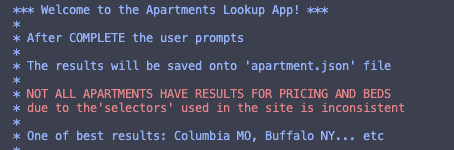

# Apartments Scraper

This is a python program that was build to get apartments information like `name`, `price` and `bed` out of a specific [Apartment Website](https://www.apartments.com/) using `scrapy` python module and saved the data into a `json` file.
<br/>
<br/>

## :hammer_and_wrench: Setting Up:

Windows:

```
pip install scrapy
pip install colorama
```

iOS:

```
pip3 install scrapy
pip3 install colorama
```

## To run the application:

In the root directory of the project, run `main.py` file.
<br/>
<br/>

:heavy_exclamation_mark: :heavy_exclamation_mark: <span>Note </span>:heavy_exclamation_mark: :heavy_exclamation_mark:

<span style="color:orange">Not ALL APARTMENTS</span>
have results for `price` and `bed`</p>
due to the [css selectors](https://www.w3schools.com/cssref/css_selectors.php) used in the site (Also noted in the program).
<br/>
<br/>



<br/>

## Difficulties I overcome

At the beginning of this project. I started up scrapy with the built-in command:

```
scrapy startproject <projectname>
```

and after countless of researching videos and resources, I finally got myself familiarize with scrapy. (You can see this code in `Convert-scrapy-...` branch)

The next problem I encountered was not knowing what css selector to use that returns the data I wanted, took me at least few hours to try-and-error.</p>

After I finally figured out the right css selector to used (based in Columbia MO), I realized another problem.
Thinking, okay sure, now it returns the right data, but I don't want the user to use `scrapy`'s specific command line to run the program, which was:

```
scrapy crawl <name for spider>
```

and what if I want to make the web scraping more dynamic? Like allow the user to choose their location rather than static "Columbia MO".

I then start to look for a way to use `scrapy` that is capable to run in a simple command line such as `python main.py`. It was a long process for me to find the right keyword on google search...

Okay now, I started over with the very first version of `scrapy project` I made, started up without using `items.py`, in the `main.py` file... and soon realized, if there is no data for that specific apartment name, then it'll print `null` for that field, which looks really messy.

Therefore, I put back the functionality in `items.py`.

After all those mess converting scrapy project to a single script, now my problem is, how do I make my `start_url` dynamic? I then found `start_request` and was what I ended up using. Something similar to the example in the link I provided in below Resource section.

```python
def start_requests(self):
    yield scrapy.Request(f'http://www.example.com/categories/{self.category}')
```

<h3>Over all, it was a fun project to make, and I was glad I chose to use scrapy afterall</h3>
(yes, I did spent few more hours and tried out another scraping module before this, but we'll not go there)

<br/>

## Resources used to build this app

- Scrapy:</br>
  https://scrapy.org/

- Scrapy Project:</br>
  https://docs.scrapy.org/en/latest/intro/tutorial.html

- Scrapy from a script:</br>
  https://towardsdatascience.com/how-to-run-scrapy-from-a-script-ff07fd6b792b

- Spider Argument:</br>
  https://docs.scrapy.org/en/latest/topics/spiders.html#spider-arguments

- Colorama:</br>
  https://pypi.org/project/colorama/

- CSS Selectors:</br>
  https://www.w3schools.com/cssref/css_selectors.php

- States Letter for `states.txt`:</br>
  https://www.faa.gov/air_traffic/publications/atpubs/cnt_html/appendix_a.html
